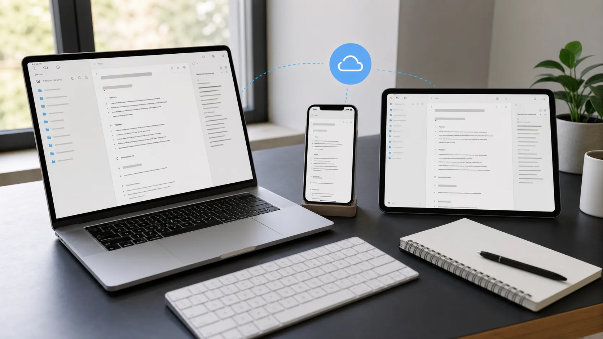
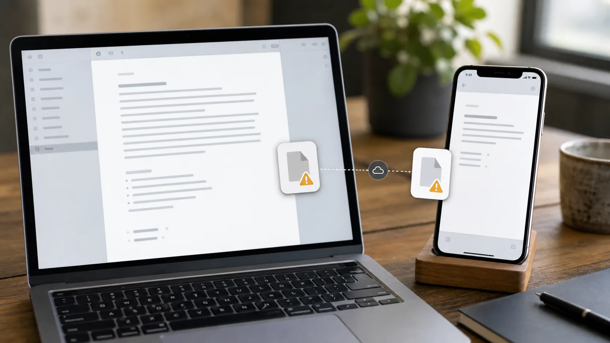
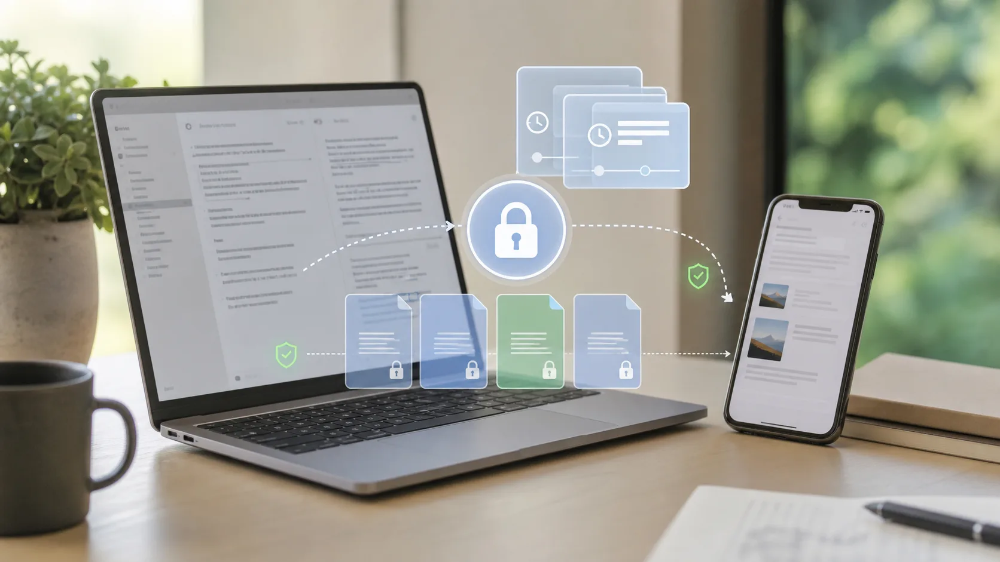

Mac과 iPhone에서 Obsidian을 쓴다면 **iCloud 동기화**는 가장 먼저 떠오르는 방법일 가능성이 큽니다.

Apple 기기에 기본으로 들어 있고, iCloud 저장 공간이 충분하다면 추가 구독 없이 쓸 수 있습니다. Apple 기기만 쓰는 단순한 환경에서는 꽤 잘 동작할 수 있습니다.

하지만 iCloud는 Obsidian 동기화 서비스가 아닙니다. 범용 파일 동기화 서비스입니다.

이 차이가 중요합니다. Obsidian vault는 Markdown 파일, 첨부 파일, 플러그인 설정, 테마, snippets, canvas 파일, 숨겨진 설정 파일이 함께 들어 있는 폴더입니다. 동기화가 늦거나, 파일이 기기에서 내려받아지지 않았거나, 두 기기가 최신 상태를 받기 전에 같은 파일을 편집하면 결과가 혼란스럽거나 위험할 수 있습니다.

이 글에서는 Obsidian iCloud 동기화가 어떻게 동작하는지, 어떻게 설정하는지, 어떤 문제를 조심해야 하는지, 언제 다른 동기화 방식을 선택하는 편이 나은지 설명합니다.

## Obsidian을 iCloud로 동기화할 수 있나요?

가능합니다. Obsidian은 Apple 기기에서 iCloud Drive에 vault를 저장하는 방식을 지원합니다.

일반적인 흐름은 다음과 같습니다.

1. Mac에서 Obsidian vault를 iCloud Drive 안에 만들거나 옮깁니다.
2. iPhone 또는 iPad의 Obsidian에서 같은 vault를 엽니다.
3. iCloud Drive가 기기 사이에서 파일을 동기화하게 둡니다.

Apple 기기만 쓰는 사용자에게는 Obsidian 노트를 무료로 동기화하는 가장 쉬운 방법일 때가 많습니다.

다만 트레이드오프를 이해해야 합니다. Obsidian이 동기화 엔진을 제어하는 것이 아닙니다. iCloud가 제어합니다. iCloud가 느리거나, 일시 중지되거나, 저장 공간이 부족하거나, 오프라인이거나, 충돌 때문에 꼬이면 Obsidian 앱 안에서 항상 해결할 수 있는 것은 아닙니다.

## Obsidian iCloud 동기화 설정 방법

vault 위치를 바꾸기 전에 iCloud 밖에 vault 복사본을 만들어 두세요. 첫 동기화는 잘못된 폴더를 가리키거나 불완전한 복사본을 최신 상태로 착각하기 가장 쉬운 순간입니다.

기본적인 Mac, iPhone, iPad 환경에서는 다음처럼 설정합니다.

1. 모든 기기가 같은 Apple 계정에 로그인되어 있는지 확인합니다.
2. 각 기기에서 iCloud Drive를 켭니다.
3. Mac에서 Obsidian을 열고 iCloud Drive 안에 새 vault를 만들거나 기존 vault를 옮깁니다.
4. iOS 또는 iPadOS에서 쓸 때는 vault를 iCloud Drive의 Obsidian 폴더 안에 둡니다.
5. iPhone 또는 iPad에 Obsidian을 설치합니다.
6. iCloud Drive에서 해당 vault를 엽니다.
7. 두 번째 기기에서 편집하기 전에 첫 전체 동기화가 끝날 때까지 기다립니다.

모바일에서는 폴더 위치가 중요합니다. Obsidian 도움말은 iCloud vault를 임의의 iCloud 폴더가 아니라 `iCloud Drive/Obsidian/[Your Vault Name]` 아래에 두는 방식을 안내합니다.

최근 macOS를 쓴다면 Obsidian 폴더를 로컬에 내려받은 상태로 유지하는 것도 중요합니다. Finder에서 iCloud Drive 안의 Obsidian 폴더를 우클릭하고 **Keep Downloaded**를 선택하세요. iPhone 또는 iPad에서는 파일 앱에서 vault 파일이 실제로 다운로드되어 있는지 확인한 뒤 오프라인에서 사용하세요.

## iCloud 동기화가 잘 맞는 경우

iCloud는 설정이 단순할 때 합리적인 Obsidian 동기화 방법이 될 수 있습니다.

잘 맞는 경우는 다음과 같습니다.

- Mac, iPhone, iPad만 사용한다
- vault가 작거나 중간 정도 크기다
- 주로 한 기기에서만 편집한다
- 큰 첨부 파일이 많지 않다
- 가끔 동기화가 늦어지는 것을 감수할 수 있다
- iCloud 밖에 별도 백업을 유지한다

주로 Mac에서 글을 쓰고 iPhone에서는 가끔 읽거나 가볍게 수정하는 정도라면 iCloud로 충분할 수 있습니다.

반대로 여러 기기에서 자주 편집하고, 오프라인 작업이 잦고, 큰 첨부 파일이 많고, 거의 즉시 반영되는 충돌 인식 동기화를 기대한다면 위험이 커집니다.

## 흔한 Obsidian iCloud 동기화 문제

iCloud 문제는 항상 명확한 "동기화 오류"로 보이지 않습니다. 실제 원인은 파일 가용성이나 동기화 타이밍인데, 겉으로는 Obsidian이 이상하게 동작하는 것처럼 보일 수 있습니다.

### iPhone 또는 iPad에 노트가 보이지 않음

Mac에는 노트가 있는데 iPhone에는 없다면 iCloud가 아직 해당 파일을 다운로드하지 않았을 수 있습니다.

다음을 확인하세요.

- 모바일 기기에서 iCloud Drive가 켜져 있는지
- vault가 올바른 iCloud Drive Obsidian 폴더 안에 있는지
- 파일 앱에서 해당 노트가 보이는지
- 기기 저장 공간이 충분한지
- Mac에서 iCloud 업로드가 끝났는지

기다리는 동안 같은 노트의 오래되었거나 불완전한 복사본을 편집하지 마세요. 충돌이 생기거나 보존하고 싶었던 버전을 덮어쓸 수 있습니다.

### vault가 비어 있거나 일부만 보임

불완전한 vault는 보통 폴더는 있지만 일부 파일이 아직 다운로드되지 않았다는 뜻입니다.

새 iPhone을 설정했거나, 기기를 복원했거나, 첨부 파일이 많은 큰 vault를 처음 열 때 특히 자주 생깁니다.

vault가 깨졌다고 판단하기 전에 파일 앱에서 같은 폴더를 확인하고 iCloud가 끝날 때까지 기다리세요. 백업이 있다면 파일을 무작정 옮기기보다 백업과 비교하세요.

### 파일이 기기에서 오프로드됨

iCloud Drive는 저장 공간을 아끼기 위해 로컬 파일 복사본을 제거할 수 있습니다. 사진이나 일반 문서에는 유용하지만, Obsidian vault에는 위험할 수 있습니다. Obsidian은 vault 파일이 로컬에 있다고 기대하기 때문입니다.

Mac에서는 Obsidian 폴더에 **Keep Downloaded**를 사용하세요. 오래된 macOS에서는 Mac 저장 공간 최적화 설정도 확인해야 할 수 있습니다.

목표는 단순합니다. vault는 placeholder가 아니라 실제 파일로 디스크에 있어야 합니다.

### 기기 사이에서 편집 충돌이 생김

두 기기가 최신 버전을 받기 전에 같은 파일을 편집하면 충돌이 생길 수 있습니다.

예를 들어 다음과 같습니다.

1. Mac에서 노트를 편집합니다.
2. Mac이 아직 업로드를 끝내지 못했습니다.
3. iPhone에서 오래된 버전의 노트를 엽니다.
4. iPhone에서 해당 노트를 편집하거나 닫습니다.
5. iCloud가 어떤 파일 버전을 남길지 결정합니다.

가장 나은 경우에는 충돌 복사본이 생깁니다. 나쁜 경우에는 한 버전이 조용히 다른 버전을 대체한 것처럼 보일 수 있습니다.

그래서 iCloud 동기화는 Mac과 모바일을 빠르게 오가며 편집하는 방식보다 한 번에 한 기기에서 편집하는 방식에 더 잘 맞습니다.

### 동기화가 멈췄거나 느림

iCloud는 Obsidian에 믿을 만한 "지금 동기화" 버튼을 제공하지 않습니다. iCloud Drive가 멈춰 있으면 Obsidian은 대부분 운영체제를 기다릴 수밖에 없습니다.

확인할 항목은 다음과 같습니다.

- 네트워크 연결
- iCloud 저장 공간 한도
- 기기 저장 공간
- 저전력 모드가 백그라운드 작업을 제한하는지
- 파일이 iCloud.com에 보이는지
- iCloud Drive가 일시 중지되었거나 다른 파일을 계속 업로드 중인지

중요한 노트라면 두 번째 기기에서 파일이 보이고 최신 상태임을 확인한 뒤 편집하세요.

## Obsidian iCloud 동기화는 안전한가요?

iCloud 동기화는 가벼운 워크플로에서는 충분히 안전할 수 있습니다. 하지만 완전한 백업이나 Obsidian 전용 동기화 시스템처럼 다루면 안 됩니다.

동기화와 백업은 다릅니다.

한 기기에서 파일이 삭제되거나, 비어 있거나, 덮어써지면 그 변경이 모든 기기로 퍼질 수 있습니다. 동기화 서비스는 기기들을 일관되게 유지합니다. 백업은 독립적인 복구 지점을 제공합니다.

Obsidian vault가 중요하다면 별도 백업을 유지하세요. Time Machine, 복사한 vault 폴더, Git 저장소, 다른 백업 도구, 버전 기록이 있는 동기화 서비스가 될 수 있습니다.

플러그인과 설정도 조심해야 합니다. `.obsidian` 폴더에는 데스크톱 전용 또는 모바일 전용 동작이 들어 있을 수 있습니다. 모든 설정을 iCloud로 동기화하면 편리하지만, Mac에 맞춘 설정이 모바일 Obsidian에 그대로 들어가 문제를 만들 수도 있습니다.

## Windows에서 Obsidian과 iCloud를 함께 써도 될까요?

보통은 추천하지 않습니다.

iCloud는 모든 기기가 Apple 생태계 안에 있을 때 가장 합리적입니다. Windows가 들어오면 위험과 마찰이 커집니다.

Windows용 iCloud Drive는 Apple 기기에서의 기본 경험보다 느리거나 예측하기 어렵고, pending 상태나 중복 파일이 생기기 쉽습니다. Obsidian vault는 자주 바뀌기 때문에 빠른 폴더 변경을 잘 처리하지 못하는 파일 동기화와 잘 맞지 않습니다.

Windows와 Apple 기기 사이에서 Obsidian을 동기화해야 한다면 다음처럼 크로스 플랫폼에 맞는 Obsidian 중심 동기화 방식을 먼저 고려하세요.

- 공식 Obsidian Sync
- Synch
- 신중하게 설정한 커뮤니티 플러그인
- 기기 간 동기화를 관리할 수 있다면 Syncthing
- 명시적인 버전 관리와 충돌 처리를 원한다면 Git

iCloud는 활발히 편집하는 Obsidian vault를 Apple 기기와 Windows 사이에서 잇는 최선의 다리는 아닙니다.

## Obsidian iCloud vs Obsidian Sync vs Synch

실용적으로 비교하면 다음과 같습니다.

| 방법 | 잘 맞는 사용자 | 강점 | 감수할 점 |
| --- | --- | --- | --- |
| iCloud Drive | 단순한 vault를 쓰는 Apple 전용 사용자 | 쉽고 대체로 무료 | Obsidian 전용이 아님 |
| Obsidian Sync | 공식 통합 서비스를 원하는 사용자 | 완성도 높고, 크로스 플랫폼이며, 종단 간 암호화 | 유료 구독 |
| Synch | 오픈소스와 종단 간 암호화가 있는 저렴한 호스팅 동기화를 원하는 사용자 | Obsidian 중심, 프라이빗, 무료 및 저가 플랜 | 더 새로운 프로젝트 |

iCloud는 파일 동기화 계층입니다. vault가 단순하고 모든 기기가 Apple 기기라면 충분할 수 있습니다.

[Obsidian Sync](https://obsidian.md/sync)는 공식 서비스입니다. 가장 다듬어진 통합 경험을 원하고 가격이 괜찮다면 가장 쉽게 추천할 수 있습니다.

Synch는 오픈소스 종단 간 암호화 Obsidian 동기화 대안입니다. 범용 클라우드 드라이브에 의존하지 않고, 공식 서비스 전체 가격을 내지 않으면서 호스팅 동기화를 원하는 사용자를 위해 설계되었습니다. Synch에는 작은 vault를 위한 무료 플랜과 더 많은 공간이 필요한 사용자를 위한 저가 Starter 플랜이 있습니다.

## Obsidian iCloud 동기화 모범 사례

iCloud를 쓰기로 했다면 보수적으로 설정하세요.

- vault를 iCloud로 옮기기 전에 백업하기
- 권장 iCloud Drive Obsidian 폴더 안에 vault 두기
- Obsidian 폴더를 로컬에 다운로드된 상태로 유지하기
- 첫 동기화가 끝나기 전에 다른 기기에서 편집하지 않기
- 같은 노트를 두 기기에서 동시에 편집하지 않기
- 오프라인 작업 시 조심하기
- 같은 vault에 여러 동기화 도구를 함께 쓰지 않기
- iCloud 밖에 독립적인 백업 유지하기

마지막 항목이 가장 중요합니다. iCloud는 기기 동기화에는 도움이 되지만 유일한 복구 전략이 되어서는 안 됩니다.

## FAQ

### Obsidian iCloud 동기화는 무료인가요?

iCloud 저장 공간이 충분하다면 무료로 쓸 수 있습니다. iCloud Drive 동기화를 위해 Obsidian에 비용을 낼 필요는 없습니다. 다만 vault와 다른 파일이 Apple의 무료 저장 공간 한도를 넘으면 iCloud 저장 공간 요금제가 필요할 수 있습니다.

### Obsidian 노트가 iPhone에 동기화되지 않는 이유는 무엇인가요?

가장 흔한 이유는 iCloud Drive가 아직 동기화를 끝내지 않았거나, vault가 예상한 iCloud Drive Obsidian 폴더 안에 없거나, 파일이 로컬에 다운로드되지 않았거나, 기기 저장 공간이 부족한 경우입니다.

### iCloud 때문에 Obsidian 데이터가 사라질 수 있나요?

모든 파일 동기화 시스템은 비어 있거나 오래되었거나 충돌한 버전이 원하는 버전을 덮어쓰면 데이터 손실에 관여할 수 있습니다. 그래서 백업을 유지하고, 최신 변경이 도착하기 전에 두 번째 기기에서 편집하지 않는 것이 중요합니다.

### iCloud와 Obsidian Sync를 함께 써도 되나요?

같은 활성 vault에 두 동기화 시스템을 함께 쓰지 마세요. iCloud Drive와 다른 Obsidian 동기화 서비스를 같은 폴더에 쓰면 충돌과 혼란스러운 삭제가 생길 수 있습니다. vault마다 하나의 기본 동기화 방법을 선택하세요.

### iCloud가 Obsidian Sync보다 나은가요?

이미 Apple 저장 공간을 쓰고 있다면 iCloud가 더 저렴할 수 있습니다. 하지만 Obsidian Sync는 Obsidian을 위해 만들어졌고 더 많은 플랫폼에서 동작합니다. 안정성과 크로스 플랫폼 동작이 비용보다 중요하다면 보통 Obsidian Sync가 더 강한 선택입니다.

### Synch는 Obsidian용 iCloud 대체재인가요?

Obsidian 중심의 종단 간 암호화 호스팅 동기화 서비스를 원한다면 Synch는 iCloud를 대신하는 동기화 계층이 될 수 있습니다. iCloud가 불안정하게 느껴지거나, Apple이 아닌 기기도 쓰거나, 공식 Obsidian Sync보다 저렴한 대안을 원할 때 특히 관련이 있습니다.

## 정리

Obsidian iCloud 동기화는 단순한 vault를 쓰는 Apple 전용 사용자에게 좋은 시작점입니다. 쉽고, 익숙하고, 대체로 무료입니다.

하지만 모든 vault에 가장 좋은 선택은 아닙니다.

노트가 중요하고, 여러 기기에서 자주 편집하고, Windows가 포함되어 있거나, 더 명확한 복구 동작을 원한다면 Obsidian 중심 동기화 도구를 고려하세요. 가장 다듬어진 공식 선택지를 원하면 Obsidian Sync를 쓰고, 더 저렴한 오픈소스 종단 간 암호화 Obsidian 동기화 대안을 원하면 Synch를 선택하세요.
