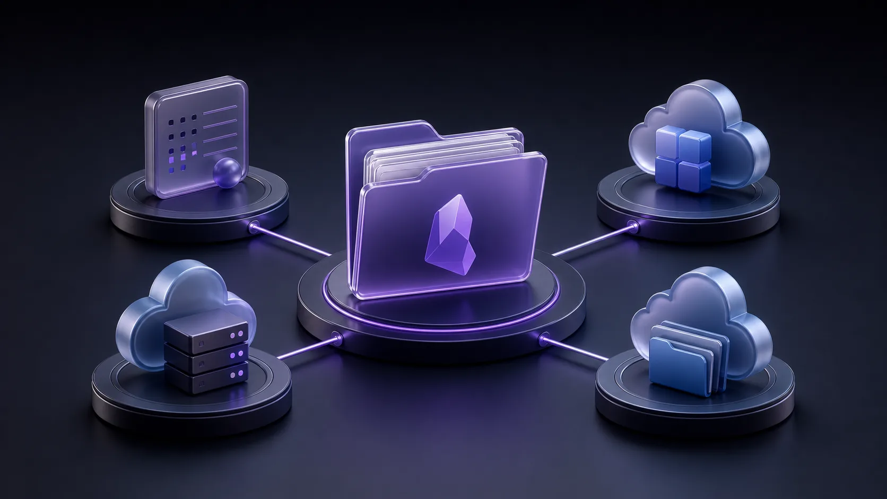
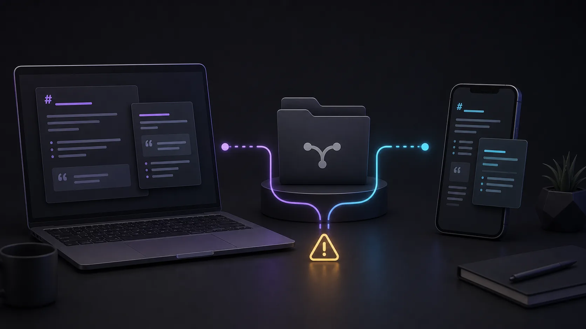
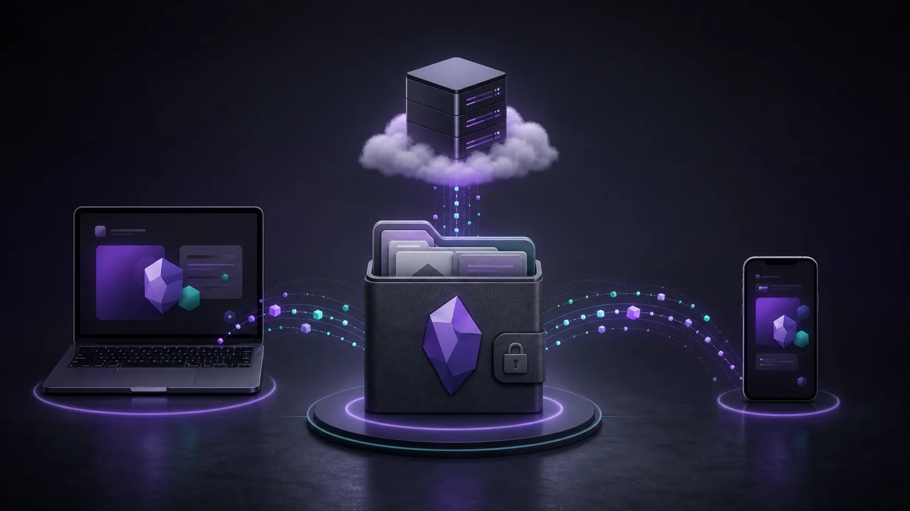

Obsidianを公式Syncなしで同期したいと考えると、**Remotely Save**はかなり早い段階で候補に入ります。

人気がある理由はわかりやすいです。同期先をひとつのサービスに固定せず、自分でストレージを選べます。S3互換ストレージ、WebDAV、Dropbox、OneDrive、Google Drive、Box、pCloud、Koofr、Azure Blob Storageなどを利用でき、対応範囲は機能プランによって変わります。

魅力は自由度です。

ただし、その自由度は設定と運用の責任でもあります。

すでに使いたい保存先があり、同期設定を自分で確認できるなら、Remotely Saveはよい選択肢になります。一方で、ほしいものが「Obsidian向けのシンプルな同期サービス」なら、別の道具のほうが合うかもしれません。

この記事では、Remotely Saveの仕組み、向いているケース、注意点、そしてSynchのような代替案を選ぶ場面を整理します。



## Remotely Saveとは

[Remotely Save](https://github.com/remotely-save/remotely-save)は、Obsidian vaultをリモートのクラウドストレージと同期する非公式のコミュニティプラグインです。

Obsidian公式のSyncサービスではありません。Obsidian内でプラグインとして動き、ユーザーが選んだストレージを同期先として使います。

基本的な流れは次のようになります。

```txt
端末AのObsidian vault
        |
Remotely Saveプラグイン
        |
選択したリモートストレージ
        |
Remotely Saveプラグイン
        |
端末BのObsidian vault
```

リモートストレージが端末間の中継点になります。構成によって、それはS3互換バケット、WebDAVサーバー、Dropbox、OneDrive、Google Drive、その他の対応サービスになります。

## Remotely Saveが選ばれる理由

いちばんの理由は、自分で管理できることです。

公式のObsidian Syncでは、同期サービスはObsidian側が用意したものを使います。Remotely Saveでは、自分のストレージを持ち込みます。すでに使っているクラウドアカウントに置きたい、特定の保存先にデータを集めたい、単一のホスト型同期サービスに依存したくない、という人には魅力があります。

特に次のような場合に向いています。

- 信頼しているストレージでObsidianを同期したい
- Cloudflare R2、Backblaze B2、MinIO、Amazon S3などのS3互換ストレージを使いたい
- 自宅サーバー、Synology、NextcloudなどのWebDAVを使いたい
- 別のデスクトップ同期アプリではなく、Obsidianプラグインとして扱いたい
- モバイルとデスクトップを同じプラグインで同期したい
- 本番のvaultを任せる前に、設定を読み、テストできる

技術的なユーザーにとっては、最短のセットアップよりも、この柔軟性のほうが重要なことがあります。

## 対応ストレージ

Remotely Saveは複数のストレージバックエンドに対応しています。正確な一覧はバージョンや機能プランで変わることがありますが、プロジェクトでは次のような選択肢が示されています。

| ストレージ | 選ばれる理由 | 主な注意点 |
| --- | --- | --- |
| S3互換ストレージ | R2、B2、MinIO、S3など、柔軟で低コストな選択肢が多い | バケット、キー、エンドポイント、料金体系を理解する必要がある |
| WebDAV | 自宅サーバー、NAS、Nextcloud系と相性がよい | WebDAVサーバーの品質に安定性が左右される |
| Dropbox | 多くの人に馴染みがある | Obsidian専用同期ではなく、汎用クラウドドライブに依存する |
| OneDrive | Microsoft個人アカウントの利用者には便利 | 無料版はApp Folder方式。個人OneDrive全体へのアクセスはPRO機能で、Businessアカウントは文書上の主対象ではない |
| Google Drive | すでに使っている人が多い | Google Drive対応はPRO connect機能 |
| Box、pCloud、Koofr、Azure Blobなど | 既存の保存先を活用できる | これらの対応は文書上PRO connect機能 |

ここが、Remotely Saveと多くのObsidian同期ツールの大きな違いです。Remotely Saveは単なる同期サービスではなく、Obsidianと多様なストレージをつなぐ橋のような存在です。

強力ですが、その先にあるストレージの性質も理解する必要があります。

## 基本的な設定の流れ

細かい手順はストレージによって変わりますが、だいたいの流れは共通しています。

1. 同期先とは別の場所にObsidian vaultをバックアップします。
2. ObsidianのコミュニティプラグインからRemotely Saveをインストールします。
3. プラグイン設定でリモートサービスを選びます。
4. 認証情報、エンドポイント、バケット、フォルダ、OAuth認可などを入力します。
5. 暗号化を有効にするか決めます。
6. 大きなファイルや特定パスを除外するか決めます。
7. 最初の同期を実行します。
8. 他の端末にもプラグインを入れ、同じように設定します。
9. 複数端末で編集する前に、同じvaultが正しく見えることを確認します。

最初のバックアップが重要です。同期ツールは、ミスもすばやく広げてしまいます。本番のvaultをつなぐ前に、プラグインが触れられない場所にコピーを残しておくべきです。

## Remotely Saveの暗号化

Remotely Saveはパスワードベースのエンドツーエンド暗号化に対応しています。暗号化パスワードを設定すると、ファイルはリモートストレージへ送られる前に暗号化されます。

一般的なクラウドストレージやオブジェクトストレージに個人的なノートを置く場合、これは重要な機能です。

ただし、次の点は理解しておく必要があります。

- すべての端末で暗号化設定を正しく合わせる必要があります。
- 暗号化パスワードを忘れると、リモート側のデータを復旧できない可能性があります。
- 一部のメタデータは、専用の暗号化同期サービスとは異なる扱いになることがあります。
- プラグイン設定ファイルには機密情報が含まれる可能性があり、共有したりGitにコミットしたりすべきではありません。

暗号化は単なるチェック項目ではありません。復旧の考え方が変わります。重要なvaultで使う前に、小さなテストvaultで別端末から復号できることを確認してください。

## 競合処理

Obsidianの同期では、競合処理が普通のファイルアップロードよりも重要になります。

vaultでは小さな変更が頻繁に起こります。ノートPCでMarkdownノートを編集し、同じノートをスマートフォンでも変えるかもしれません。プラグイン設定が別端末で更新されることもあります。大きな添付ファイルがアップロード中のまま、別の端末で編集が始まることもあります。端末同士が最新状態を確認する前に同じ領域を変えると、同期ツールは何を残すか決めなければなりません。

Remotely Saveには基本的な競合検出と処理があり、より高度なSmart ConflictはPRO merge機能として提供されます。便利ですが、よい同期習慣の代わりにはなりません。

避けたい使い方は次の通りです。

- 同じノートを複数端末で大きく編集してから同期する
- 同じactive vaultに複数の同期ツールを同時に使う
- クラウドバックエンドを完全なバックアップだと思い込む
- モバイルとデスクトップの違いを理解せずにプラグイン設定まで同期する
- 競合ファイルを軽く扱って放置する

大事なvaultなら、独立したバックアップを持つべきです。同期は端末を同じ状態にそろえる仕組みです。バックアップは、その同じ状態が間違っていたときに戻る場所です。



## モバイル同期

Remotely SaveはObsidian mobileに対応しています。これも人気の理由です。

汎用的なファイル同期ツールは、デスクトップでは問題なくても、スマートフォンやタブレットでは弱くなることがあります。AndroidとiOSには、バックグラウンド処理、ファイルアクセス、長時間タスクへの制限があります。Obsidianの中で動くプラグインは、別の同期アプリより扱いやすい場合があります。

それでもモバイルには現実的な制約があります。

- Obsidianを開いている間のほうが同期は安定しやすい
- 大きなファイルはモバイルで遅くなったり失敗したりする
- OAuthやログインの流れがプラットフォームによって違う
- モバイル回線の切り替えで長い同期が止まることがある
- 端末ごとのプラグイン設定をそろえる必要がある

Markdown中心の小さなvaultなら十分に使えることがあります。添付ファイル、大きなPDF、録音データが多い場合や、複数端末で頻繁に編集する場合は、本格運用の前にしっかり試すべきです。

## Remotely SaveとObsidian Sync

Remotely SaveとObsidian Syncは似た問題を扱いますが、約束しているものが違います。

| 選択肢 | 向いている人 | 強み | トレードオフ |
| --- | --- | --- | --- |
| Remotely Save | 自分のストレージを使いたい人 | 保存先を選べる | 設定とバックエンド管理の責任がある |
| Obsidian Sync | 公式統合サービスを使いたい人 | Obsidianに自然に組み込まれた体験 | 有料サブスクリプションとプロプライエタリなホスト型サービス |

最も摩擦の少ない方法を求めるなら、Obsidian Syncのほうが勧めやすいです。Obsidianチームが作っており、アプリに統合されています。

保存先を自分で選ぶことを重視するなら、Remotely Saveのほうが柔軟です。

## Remotely SaveとSyncthing

SyncthingもObsidian vaultの同期によく使われる無料の選択肢です。オープンソースで、ピアツーピア方式のため、中央のクラウドストレージなしで端末同士を直接同期できます。

デスクトップ同士の同期では強いモデルです。

一方で、端末が適切なタイミングでオンラインであることが重要になります。モバイル設定もやや扱いにくく、Obsidianの中で自然に完結する使い心地を求める人には重く感じることがあります。

Remotely Saveはリモートストレージを中継点にします。Syncthingは端末間の直接同期です。どちらが上かではなく、クラウド中継を好むか、P2Pを好むかの違いです。

## Remotely SaveとSelf-hosted LiveSync

Self-hosted LiveSyncは、より高度なセルフホスト同期を求めるユーザー向けの強力なObsidianプラグインです。バックエンドを自分で運用できる技術ユーザーにはよい選択肢になります。

Remotely Saveに比べると、Self-hosted LiveSyncは同期アーキテクチャに対してより明確なモデルを持っています。Remotely Saveは対応ストレージの幅が広いです。LiveSyncは、そのモデルを求め、正しく運用できるなら非常に強力です。

非技術ユーザーにとっては、どちらも思った以上にインフラ寄りに感じられるかもしれません。

## Remotely Saveが合う場合

自分で同期スタックを組み立てることに抵抗がないなら、Remotely Saveは検討する価値があります。

向いているのは次のような場合です。

- すでに使いたいストレージがある
- S3、R2、B2、MinIO、WebDAVなどの特定バックエンドを使いたい
- 認証情報やプラグイン設定を管理できる
- 同期とバックアップは別物だと理解している
- 本番vaultを任せる前にコピーで試せる
- 専用ホスト型サービスよりコミュニティプラグインを使いたい

この文脈では、Remotely Saveがぴったりの道具になることがあります。

## Remotely Saveが合わない場合

本当に求めているものが「できるだけ少ない設定で、Obsidianをプライベートに同期したい」なら、Remotely Saveは最短距離ではないかもしれません。

次に当てはまるなら、別の選択肢も考える価値があります。

- ストレージバックエンドを選んだり設定したりしたくない
- アクセスキー、WebDAV URL、バケット、サービスごとの設定を管理したくない
- Obsidian vaultの動作を中心に設計された同期サービスがほしい
- 公式Obsidian Syncを使わずにホスト型同期を使いたい
- 複数端末の導入や復旧をもっと簡単にしたい

整理すると、Remotely Saveは自分のストレージを持ち込む人のための柔軟な同期プラグインです。

すぐ使えるObsidian同期サービスを求めることとは、少し違います。

## よりシンプルな代替案: Synch

Remotely Saveのプライバシー面は魅力的でも、ストレージ選びや設定まで自分でやるのが負担なら、[Synch](https://synch.run/)を検討できます。

Synchは、Obsidianユーザー向けのオープンソースでエンドツーエンド暗号化された同期サービスです。ストレージ事業者を持ち込んでプラグインにつなぐのではなく、Synchがホスト型の同期レイヤーを提供し、Obsidian vaultのワークフローに集中します。

選び方は次のようになります。

| Remotely Saveが向く場合 | Synchが向く場合 |
| --- | --- |
| 自分のストレージを使いたい | ホスト型のObsidian同期がほしい |
| ストレージ提供者の設定に慣れている | 設定を少なくしたい |
| S3、WebDAV、Dropboxなどをすでに使っている | vault中心に設計されたサービスがほしい |
| バックエンドの柔軟性を重視する | よりシンプルな暗号化同期を使いたい |

Remotely Saveは、ストレージ層を自分で管理したい人には強い選択肢です。とはいえ、求めているものがストレージ選定ではなくプライベートなObsidian同期なら、Synchのほうが自然に感じられるかもしれません。



## 安全に使うためのチェックリスト

どの同期方法を選ぶ場合でも、大事なvaultを接続する前に次を確認してください。

- 最初の同期前に完全なバックアップを作る。
- 小さなテストvaultで試す。
- 同じactive vaultに複数の同期ツールを使わない。
- 2台目の端末で暗号化と復号を確認してから信頼する。
- 認証情報やプラグイン設定をGitに入れない。
- `.obsidian`設定がどう同期されるか確認する。
- 同期がうまく見えても独立したバックアップを続ける。

最後の項目は重要です。同期ツールは端末同士を同じ状態にします。誤削除や空ファイルがその「同じ状態」になったとき、同期の外にあるバックアップが必要です。

## まとめ

Remotely Saveは、選択肢を持てるという意味で非常に便利なObsidian同期プラグインです。すでに使っているストレージにvaultをつなぎ、暗号化を設定し、デスクトップとモバイルで同期できます。公式サービスひとつに縛られる必要はありません。

ただし、その選択には責任があります。バックエンドを選び、正しく設定し、制限を理解し、復旧手段をテストする必要があります。

その管理権がほしいなら、Remotely Saveは真剣に検討する価値があります。

より少ない設定で、プライベートなホスト型エンドツーエンド暗号化Obsidian同期を使いたいなら、Synchのほうがシンプルな選択になるかもしれません。
