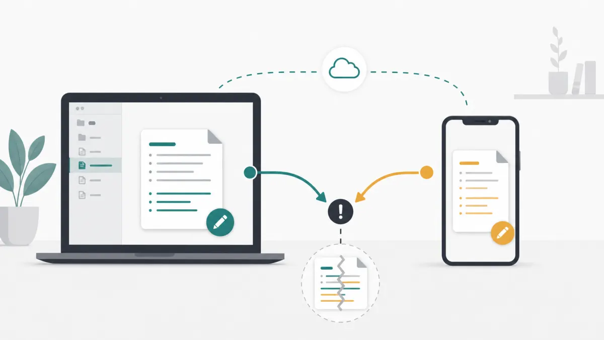
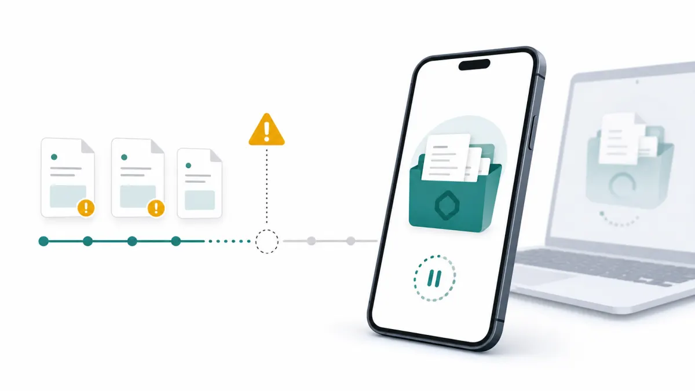
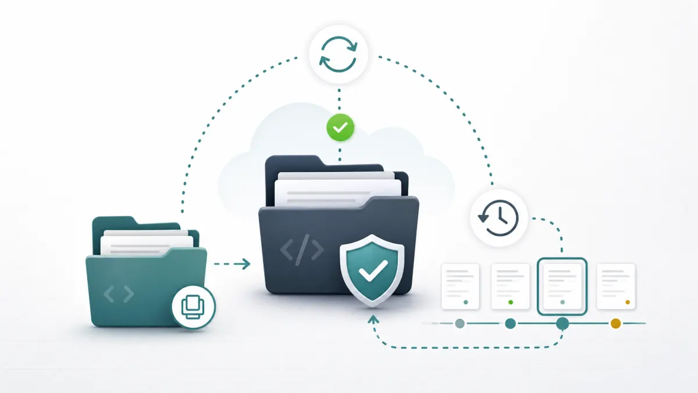

Obsidian is powerful because your notes are just files. A vault is a folder you can inspect, back up, move, and edit with other tools.

That same strength is also why sync conflicts can be frustrating.

If two devices edit the same note before they have seen each other's changes, a sync tool has to make a decision. It can keep one version, create a duplicate, write a conflicted copy, or ask you to resolve the difference. If the tool is a general file sync service, it may not understand which file is a note, which file is a plugin setting, and which change matters most.

This is how people end up searching for problems like:

- Obsidian duplicated my note
- Obsidian conflicted copy
- Obsidian sync deleted files
- Obsidian notes missing after sync
- Obsidian iCloud or Dropbox conflict
- Obsidian mobile sync not working

The good news is that most Obsidian sync conflicts are understandable. They usually come from a few repeated patterns.

## What a Sync Conflict Means

A sync conflict happens when a sync system cannot safely combine two or more versions of a file.

Imagine this sequence:

1. Your laptop has `Daily notes/2026-05-14.md`.
2. Your phone downloads that note.
3. Your laptop edits the note while the phone is offline.
4. Your phone also edits the old version while it is offline.
5. Both devices reconnect.

Now there are two real versions of the same file path. A sync tool cannot always know which one you intended to keep. If it silently chooses one, you may lose work. If it keeps both, you may see a duplicate or conflict file.

That duplicate can feel messy, but it is often the safer outcome. A visible conflict is easier to repair than an invisible overwrite.

## Why Obsidian Vaults Conflict More Than Normal Folders

An Obsidian vault looks like a simple folder, but it is more active than many people expect.

Your vault may include:

- Markdown notes
- Images, PDFs, audio, and other attachments
- Canvas files
- Plugin settings
- Theme and CSS snippet files
- Workspace layout files
- Mobile-specific settings
- Hidden files inside `.obsidian`

Some of these files are edited by you. Some are edited by Obsidian. Some are edited by community plugins. A file can change even when you did not consciously edit a note.

That matters because most sync tools operate at the file level. They see "this file changed here" and "this file changed there." They do not always understand whether a change is a meaningful note edit, a temporary workspace update, or a plugin rewriting its own settings file.

## The Most Common Causes

### 1. Editing Before Sync Is Finished

This is the classic conflict.

You open Obsidian on your phone, type a quick note, and later realize the laptop version had not finished uploading. Or you wake a laptop, start writing immediately, and the phone's latest edits have not arrived yet.

The risk is highest when:

- One device has been offline
- Mobile background sync is delayed
- A large attachment is still uploading
- You switch devices quickly
- You use a sync method that requires manual pull, push, or sync commands

The fix is boring but effective: before editing on a second device, wait until sync is complete. If your sync tool has a status indicator, check it. If it uses manual commands, run them before writing.

### 2. Syncing the Same Vault With Two Tools

Do not sync one Obsidian vault with multiple sync systems at the same time unless you deeply understand the interaction.

For example, avoid combinations like:

- Obsidian Sync plus iCloud Drive for the same vault
- Syncthing plus Dropbox for the same vault
- Git automation plus a cloud drive on the same folder
- A community sync plugin plus a file sync folder around the vault

This can create loops, stale versions, duplicated files, and confusing conflict behavior. Each sync system may believe it is the source of truth.

If you are migrating from one sync method to another, turn the old one off first. Make a backup, verify the new method, and only then delete the old remote copy if you no longer need it.

### 3. Syncing Too Much of `.obsidian`

The `.obsidian` folder stores important vault configuration. It can include plugins, settings, themes, snippets, workspace state, and device-specific layout files.

Syncing all of it can be convenient. Your hotkeys, plugin list, and theme follow you everywhere.

It can also create problems. A desktop layout may not make sense on mobile. A plugin may rewrite settings frequently. Two devices may disagree about a workspace file that you do not care about.

There is no universal answer. The safer approach is to decide intentionally.

If you want the same experience everywhere, sync most settings but keep an eye on plugin conflicts. If you want each device to have its own layout, exclude workspace and device-specific files where your sync tool supports exclusions.

### 4. Fast Plugin or Attachment Changes

Some files change quickly:

- Databases created by plugins
- JSON settings files
- Canvas files
- Large PDFs or images
- Notes created by capture workflows
- Files renamed by automation

Rapid changes are harder to sync safely, especially when mobile devices sleep, networks change, or large uploads lag behind smaller Markdown edits.

If you often attach large files, give them time to upload before editing the same vault elsewhere. If a plugin writes large or frequently changing data files, check whether those files should be synced at all.

### 5. Case and Path Differences

Different platforms do not always treat file names the same way.

A path that works on one system can cause trouble on another. Examples include:

- `Ideas.md` and `ideas.md`
- File names with reserved characters
- Very long paths
- Renames that only change letter casing
- Attachments moved by one device while another device still references the old path

Obsidian itself is cross-platform, but your sync layer still has to reconcile file system behavior across macOS, Windows, Linux, iOS, and Android.

Keep note and attachment names simple when possible. Avoid case-only renames if you sync across platforms. If you need to rename `ideas.md` to `Ideas.md`, rename it through an intermediate name first, such as `ideas-temp.md`, let it sync, and then rename it again.

## Are Conflict Files Bad?

Not always.

A conflict file means the sync tool decided not to overwrite one version with another. That can be annoying, but it protects you from silent data loss.

The real problem is not that a conflict file exists. The problem is when you do not notice it, do not know which version is current, or delete the wrong copy.

When you find a conflict:

1. Stop editing that note on other devices.
2. Open both versions.
3. Copy the missing content into the version you want to keep.
4. Rename or delete the conflict file only after the merge is complete.
5. Let the final version sync before editing elsewhere.

If your sync tool has version history, check it before deleting anything. Version history can save you when both visible files are confusing.

## How to Make Obsidian Sync Safer

You cannot remove every possible conflict, but you can reduce the odds dramatically.

### Keep a Separate Backup

Sync is not the same thing as backup.

Sync copies changes. If you accidentally delete a folder and that deletion syncs everywhere, sync may faithfully spread the mistake. A real backup gives you another recovery point.

Before changing sync tools, moving a vault, or enabling a new plugin that touches many files, make a separate copy of the vault. A simple local copy is better than nothing. A versioned backup is better.

### Let Sync Finish Before Switching Devices

Build a habit:

- Finish writing on device A.
- Confirm sync is complete.
- Open device B.
- Confirm device B has received changes.
- Start editing.

This matters most for daily notes, inbox notes, and active project notes that you edit from multiple devices.

### Avoid Double Sync

Pick one primary sync method for a vault.

If you use Obsidian Sync, do not also put the same vault inside a cloud drive sync folder. If you use Syncthing, do not also let Dropbox or iCloud manage that exact folder. If you use Git, be careful with automated pulls and pushes running alongside another file sync system.

One vault should have one clear sync authority.

### Decide What Settings Should Sync

Treat `.obsidian` as configuration, not just another folder.

For many users, syncing plugin lists and basic settings is helpful. Syncing workspace layout files across desktop and mobile may be less helpful. Syncing plugin databases depends on the plugin.

If conflicts repeatedly appear in settings files you do not care about, consider excluding them. If the conflicts appear in files you do care about, slow down and understand which device or plugin is rewriting them.

### Prefer Sync Tools With Version History

Version history is one of the most important safety features for Obsidian.

It helps when:

- A note is overwritten
- A folder is deleted
- A bad merge removes content
- A plugin changes many files
- You discover the problem hours or days later

The more important your vault is, the less you should rely on "latest file wins" sync behavior without recovery.

## Which Sync Methods Are Most Conflict-Prone?

Any sync method can conflict. The difference is how visible, recoverable, and understandable the conflict is.

General cloud drives such as iCloud Drive, Dropbox, Google Drive, and OneDrive can work for simple vaults, but they are not built specifically around Obsidian behavior. They may be enough if you mostly edit on one device and use others for reading.

Syncthing is strong for peer-to-peer file sync, especially for technical users, but it still syncs files rather than Obsidian intent. You need to understand device availability, conflict files, and exclusions.

Git is excellent for history and text diffs, but it is not effortless sync for most note-taking workflows. It asks you to think about commits, pulls, pushes, and merges.

Community plugins can be flexible, but conflict behavior depends on the plugin, storage backend, and settings.

Official [Obsidian Sync](https://obsidian.md/sync) is the most integrated paid option. It supports end-to-end encryption and version history, and its conflict behavior is designed for Obsidian users.

[Synch](/) is built for users who want a lower-cost, open-source, end-to-end encrypted Obsidian sync alternative. The important design goal is not just moving files between devices. It is preserving vault safety: encrypted sync, understandable state, and recovery through version history.

## A Practical Conflict Prevention Checklist

Before you edit a synced vault on another device, ask:

- Has the previous device finished syncing?
- Has this device received the latest changes?
- Am I syncing this vault with only one sync method?
- Do I have a backup before major changes?
- Do I know whether `.obsidian` settings should sync?
- Does my sync method preserve version history?
- If a conflict appears, do I know how to merge it instead of deleting it?

If the answer to several of these is no, slow down before writing important notes.

## The Bottom Line

Obsidian sync conflicts are not random. They usually happen when multiple devices, offline edits, active settings files, large attachments, or overlapping sync tools create more than one valid version of the same file.

The safest Obsidian sync setup is not just the fastest one. It is the one that gives you a clear source of truth, protects your private notes, shows you when sync is complete, keeps enough history to recover from mistakes, and does not hide conflicts until it is too late.

Your vault is valuable because it is yours. Sync should preserve that ownership, not make it fragile.
